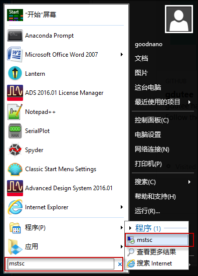
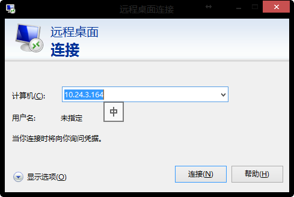
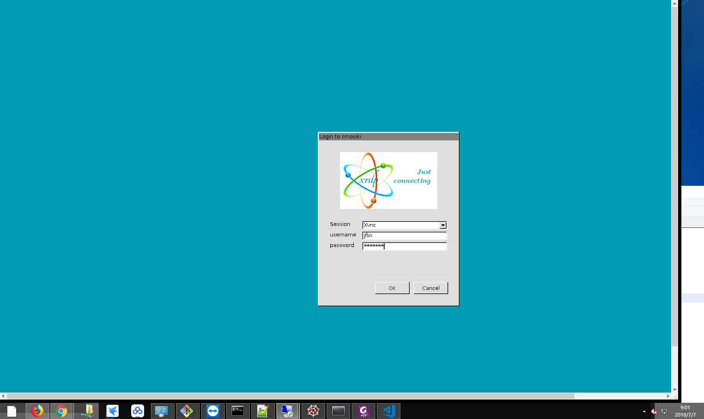
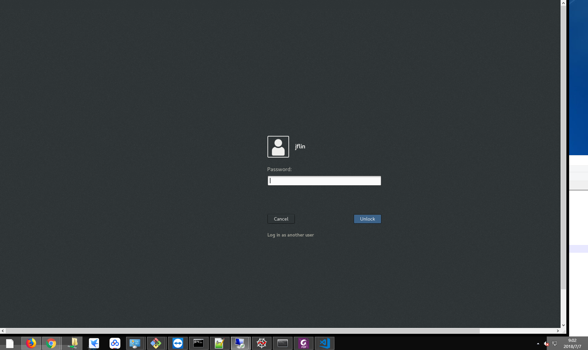
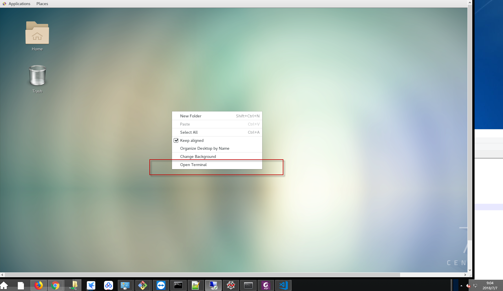
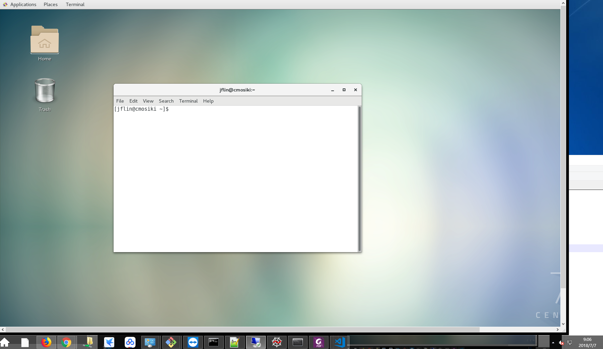

# CMOSIKI Server
- Server IP: 10.24.3.164 (Dynamic IP)
- remote access protocal (RDP)

# How To (Windows)

- Windown +R , 运行 $mstsc$ 程序

 
 - 出现登录界面，点击  **连接**

 
- 输入登录账户密码

 
- 如果桌面应用再次需要密码，输入即可

- 登录Centos7 操作系统，右键弹出菜单，点击 open terminal

- 打开terminal 成功，接下来你就可以运行linux命令了

